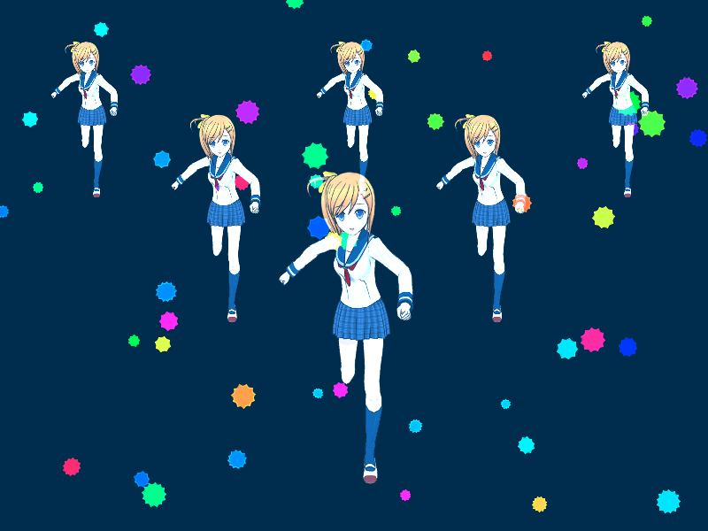
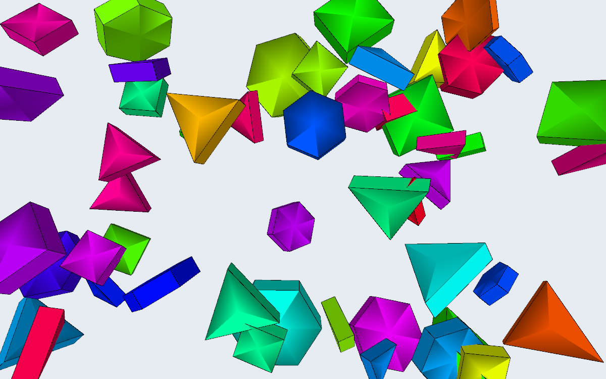

# processing.py-in-ten-lessons

### Website

https://tabreturn.github.io/code/processing/python/2021/04/16/processing.py_in_ten_lessons-resources.html

### Book

### Book

クリエイティブコーディング メイキングブック

https://booth.pm/ja/items/3103536

Learn Python Visually  
Creative Coding with Processing.py  
by Tristan Bunn  

### Products

lesson_1_0.py

lesson_1_1.py

lesson_1_2.py

lesson_1_3.py

lesson_1_4.py

lesson_1_5.py

lesson_1_6.py

lesson_1_7.py

lesson_1_8.py

lesson_1_9.py

lesson_1_10.py

lesson_1_11.py

lesson_1_12.py

lesson_1_12_1.py

lesson_2_1.py

lesson_2_2.py

lesson_2_3.py

lesson_2_4_1.py

lesson_2_4_2.py

lesson_2_4_3.py

lesson_2_4_4.py

lesson_2_4_5.py

lesson_2_4_6.py

lesson_2_4_7.py

lesson_2_5.py

lesson_2_6.py

lesson_2_7.py

lesson_2_8_1.py

lesson_2_8_2.py

lesson_2_9.py

lesson_3_1.py

lesson_3_2.py

lesson_3_3.py

lesson_3_4.py

creative_coding0_1.py

creative_coding2_1.py

creative_coding2_2.py

creative_coding2_3.py

creative_coding2_4.py

creative_coding3_1.py

creative_coding3_2.py

creative_coding3_3.py

